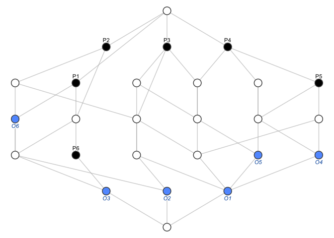

<!-- README.md is generated from README.Rmd. Please edit that file -->

# fcaR: Tools for Formal Concept Analysis

<!-- badges: start -->

[](https://www.tidyverse.org/lifecycle/#stable)
[](https://cran.r-project.org/package=fcaR)
[](https://codecov.io/gh/neuroimaginador/fcaR)
[](https://github.com/neuroimaginador/fcaR/actions)
[](https://cran.r-project.org/package=fcaR)
<!-- badges: end -->

The aim of this package is to provide tools to perform fuzzy formal
concept analysis (FCA) from within R. It provides functions to load and
save a Formal Context, extract its concept lattice and implications. In
addition, one can use the implications to compute semantic closures of
fuzzy sets and, thus, build recommendation systems.

## Details

The fcaR package provides data structures which allow the user to work
seamlessly with formal contexts and sets of implications. More
explicitly, three main classes are implemented, using the
object-oriented-programming paradigm in R:

-   FormalContext encapsulates the definition of a formal context (G, M,
    I), being G the set of objects, M the set of attributes and I the
    (fuzzy) relationship matrix, and provides methods to operate on the
    context using FCA tools.
-   ImplicationSet represents a set of implications over a specific
    formal context.
-   ConceptLattice represents the set of concepts and their
    relationships, including methods to operate on the lattice.

Two additional helper classes are implemented:

-   SparseSet is a class solely used for visualization purposes, since
    it encapsulates in sparse format a (fuzzy) set.
-   SparseConcept encapsulates internally both extent and intent of a
    formal concept as SparseSet.

Since fcaR is an extension of the data model in the arules package, most
of the methods and classes implemented interoperates with the main S4
classes in arules (transactions and rules).

## Installation

This package is available at CRAN, so its stable version can be easily
installed using:

    install.packages("fcaR")

The development version of this package can be installed with

    remotes::install_github("neuroimaginador/fcaR", build_vignettes = TRUE)

## Example of Use

<!-- Example from [here](https://www.sciencedirect.com/science/article/pii/S1877705812021418) -->
Let us start with a fuzzy dataset (stored in a matrix I) as follows:
<table>
<thead>
<tr>
<th style="text-align:left;">
</th>
<th style="text-align:right;">
P1
</th>
<th style="text-align:right;">
P2
</th>
<th style="text-align:right;">
P3
</th>
<th style="text-align:right;">
P4
</th>
<th style="text-align:right;">
P5
</th>
<th style="text-align:right;">
P6
</th>
</tr>
</thead>
<tbody>
<tr>
<td style="text-align:left;">
O1
</td>
<td style="text-align:right;">
0.0
</td>
<td style="text-align:right;">
1.0
</td>
<td style="text-align:right;">
0.5
</td>
<td style="text-align:right;">
0.5
</td>
<td style="text-align:right;">
1.0
</td>
<td style="text-align:right;">
0
</td>
</tr>
<tr>
<td style="text-align:left;">
O2
</td>
<td style="text-align:right;">
1.0
</td>
<td style="text-align:right;">
1.0
</td>
<td style="text-align:right;">
1.0
</td>
<td style="text-align:right;">
0.0
</td>
<td style="text-align:right;">
0.0
</td>
<td style="text-align:right;">
0
</td>
</tr>
<tr>
<td style="text-align:left;">
O3
</td>
<td style="text-align:right;">
0.5
</td>
<td style="text-align:right;">
0.5
</td>
<td style="text-align:right;">
0.0
</td>
<td style="text-align:right;">
0.0
</td>
<td style="text-align:right;">
0.0
</td>
<td style="text-align:right;">
1
</td>
</tr>
<tr>
<td style="text-align:left;">
O4
</td>
<td style="text-align:right;">
0.0
</td>
<td style="text-align:right;">
0.0
</td>
<td style="text-align:right;">
0.0
</td>
<td style="text-align:right;">
1.0
</td>
<td style="text-align:right;">
0.5
</td>
<td style="text-align:right;">
0
</td>
</tr>
<tr>
<td style="text-align:left;">
O5
</td>
<td style="text-align:right;">
0.0
</td>
<td style="text-align:right;">
0.0
</td>
<td style="text-align:right;">
1.0
</td>
<td style="text-align:right;">
0.5
</td>
<td style="text-align:right;">
0.0
</td>
<td style="text-align:right;">
0
</td>
</tr>
<tr>
<td style="text-align:left;">
O6
</td>
<td style="text-align:right;">
0.5
</td>
<td style="text-align:right;">
0.0
</td>
<td style="text-align:right;">
0.0
</td>
<td style="text-align:right;">
0.0
</td>
<td style="text-align:right;">
0.0
</td>
<td style="text-align:right;">
0
</td>
</tr>
</tbody>
</table>

Here, a value *x* in the intersection of a row and a column indicates
that the object of the corresponding row possesses the attribute in the
column in a degree of at least *x* (if *x* = 0, the attribute is absent
in the object, and if *x* = 1, the attribute is fully present in the
object).

We can build a FormalContext object:

``` r
fc <- FormalContext$new(I)

print(fc)
#> Registered S3 method overwritten by 'pryr':
#>   method      from
#>   print.bytes Rcpp
#> FormalContext with 6 objects and 6 attributes.
#>       P1    P2    P3    P4    P5    P6  
#>   O1   0     1    0.5   0.5    1    0   
#>   O2   1     1     1     0     0    0   
#>   O3  0.5   0.5    0     0     0    1   
#>   O4   0     0     0     1    0.5   0   
#>   O5   0     0     1    0.5    0    0   
#>   O6  0.5    0     0     0     0    0
```

With a single function, we can compute the set of concepts:

``` r
# Compute all concepts
fc$find_concepts()

# The first concept
fc$concepts[1]
#> ({O1, O2, O3, O4, O5, O6}, {})

# And plot the concept lattice
fc$concepts$plot()
```



We can also extract implications from the formal context:

``` r
# Extract implications
fc$find_implications()

# Which implications have been extracted
fc$implications
#> Implication set with 12 implications.
#> Rule 1: {P6 [0.5]} -> {P1 [0.5], P2 [0.5], P6}
#> Rule 2: {P5 [0.5]} -> {P4 [0.5]}
#> Rule 3: {P3 [0.5], P4 [0.5], P5 [0.5]} -> {P2, P5}
#> Rule 4: {P3 [0.5], P4} -> {P3}
#> Rule 5: {P2 [0.5], P4 [0.5]} -> {P2, P3 [0.5], P5}
#> Rule 6: {P2 [0.5], P3 [0.5]} -> {P2}
#> Rule 7: {P2, P3, P4 [0.5], P5} -> {P4}
#> Rule 8: {P1 [0.5], P4 [0.5]} -> {P1, P2, P3, P4, P5, P6}
#> Rule 9: {P1 [0.5], P3 [0.5]} -> {P1, P2, P3}
#> Rule 10: {P1 [0.5], P2} -> {P1}
#> Rule 11: {P1, P2 [0.5]} -> {P2}
#> Rule 12: {P1, P2, P3, P6} -> {P4, P5}
```

Some fundamental functionalities on the concept lattice associated to
the formal context have been implemented:

-   Computing a sublattice.
-   Calculating the subconcepts and superconcepts of a given concept.
-   Finding the join- and meet- irreducible elements, which allows to
    reduce the context and find the *standard context*.

Also, one can compute the support of both implications and concepts:

``` r
fc$implications$support()
#>  [1] 0.1666667 0.3333333 0.1666667 0.0000000 0.1666667 0.3333333 0.0000000
#>  [8] 0.0000000 0.1666667 0.1666667 0.1666667 0.0000000
fc$concepts$support()
#>  [1] 1.0000000 0.5000000 0.3333333 0.1666667 0.1666667 0.1666667 0.0000000
#>  [8] 0.5000000 0.3333333 0.3333333 0.1666667 0.0000000 0.5000000 0.3333333
#> [15] 0.3333333 0.1666667 0.1666667 0.0000000 0.5000000 0.3333333 0.1666667
#> [22] 0.1666667 0.1666667 0.0000000 0.1666667 0.0000000
```

In this package, we have implemented a logic to manage implications.
This so-called Simplification Logic allows us to simplify the extracted
rules by removing redundancies, as well as computing the closure of a
given fuzzy attribute set.

``` r
# Reduce the number of implications using two simple
# rules. The algorithm applies the specified rules
# in batches, if the number of rules is high.
fc$implications$apply_rules(rules = c("composition",
                                      "generalization"))
#> Processing batch
#> --> Composition: from 12 to 12 in 0.013 secs.
#> --> Generalization: from 12 to 12 in 0.019 secs.
#> Batch took 0.043 secs.

# Reduced set of implications
fc$implications
#> Implication set with 12 implications.
#> Rule 1: {P6 [0.5]} -> {P1 [0.5], P2 [0.5], P6}
#> Rule 2: {P5 [0.5]} -> {P4 [0.5]}
#> Rule 3: {P3 [0.5], P4 [0.5], P5 [0.5]} -> {P2, P5}
#> Rule 4: {P3 [0.5], P4} -> {P3}
#> Rule 5: {P2 [0.5], P4 [0.5]} -> {P2, P3 [0.5], P5}
#> Rule 6: {P2 [0.5], P3 [0.5]} -> {P2}
#> Rule 7: {P2, P3, P4 [0.5], P5} -> {P4}
#> Rule 8: {P1 [0.5], P4 [0.5]} -> {P1, P2, P3, P4, P5, P6}
#> Rule 9: {P1 [0.5], P3 [0.5]} -> {P1, P2, P3}
#> Rule 10: {P1 [0.5], P2} -> {P1}
#> Rule 11: {P1, P2 [0.5]} -> {P2}
#> Rule 12: {P1, P2, P3, P6} -> {P4, P5}
```

All these functions work natively with fuzzy and with binary datasets.

For more details on the methods implemented and further examples, see
the vignettes in this package.

## References

Guigues J, Duquenne V (1986). “Familles minimales d’implications
informatives résultant d’un tableau de données binaires.” *Mathématiques
et Sciences humaines*, *95*, 5-18.

Ganter B, Wille R (1999). *Formal concept analysis : mathematical
foundations*. Springer. ISBN 3540627715.

Cordero P, Enciso M, Mora Á, Pérez de Guzman I (2002). “SLFD Logic:
Elimination of Data Redundancy in Knowledge Representation.” *Advances
in Artificial Intelligence - IBERAMIA 2002*, *2527*, 141-150. doi:
10.1007/3-540-36131-6\_15 (URL:
<https://doi.org/10.1007/3-540-36131-6_15>).

Belohlavek R (2002). “Algorithms for fuzzy concept lattices.” In *Proc.
Fourth Int. Conf. on Recent Advances in Soft Computing*. Nottingham,
United Kingdom, 200-205.

Hahsler M, Grun B, Hornik K (2005). “arules - a computational
environment for mining association rules and frequent item sets.” *J
Stat Softw*, *14*, 1-25.

Mora A, Cordero P, Enciso M, Fortes I, Aguilera G (2012). “Closure via
functional dependence simplification.” *International Journal of
Computer Mathematics*, *89*(4), 510-526.

Belohlavek R, Cordero P, Enciso M, Mora Á, Vychodil V (2016). “Automated
prover for attribute dependencies in data with grades.” *International
Journal of Approximate Reasoning*, *70*, 51-67.
