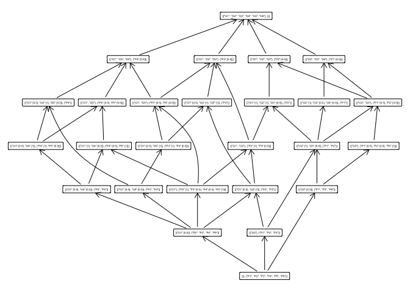
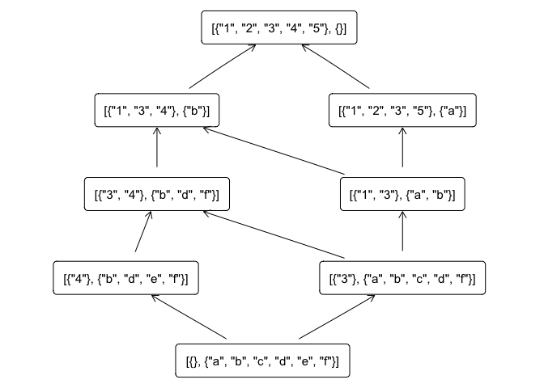

<!-- README.md is generated from README.Rmd. Please edit that file -->

# fcaR

<!-- badges: start -->

[](https://www.tidyverse.org/lifecycle/#experimental)
[](https://cran.r-project.org/package=fcaR)
[](https://travis-ci.org/neuroimaginador/fcaR)
[](https://codecov.io/gh/neuroimaginador/fcaR?branch=master)
<!-- badges: end -->

The goal of fcaR is to provide FCA tools inside the R environment.

## Installation

The development version of this package can be installed with

    remotes::install_github("neuroimaginador/fcaR")

## Example in Fuzzy Formal Context

Example from
[here](https://www.sciencedirect.com/science/article/pii/S1877705812021418)

``` r

library(fcaR)

# Table 2 in the paper

objects <- paste0("O", 1:6)
n_objects <- length(objects)

attributes <- paste0("P", 1:6)
n_attributes <- length(attributes)

I <- matrix(data = c(0, 1, 0.5, 0, 0, 0.5,
                     1, 1, 0.5, 0, 0, 0,
                     0.5, 1, 0, 0, 1, 0,
                     0.5, 0, 0, 1, 0.5, 0,
                     1, 0, 0, 0.5, 0, 0,
                     0, 0, 1, 0, 0, 0),
            nrow = n_objects,
            byrow = FALSE)

grades_set <- sort(unique(as.vector(I)))

colnames(I) <- attributes
rownames(I) <- objects

print(I)
#>     P1  P2  P3  P4  P5 P6
#> O1 0.0 1.0 0.5 0.5 1.0  0
#> O2 1.0 1.0 1.0 0.0 0.0  0
#> O3 0.5 0.5 0.0 0.0 0.0  1
#> O4 0.0 0.0 0.0 1.0 0.5  0
#> O5 0.0 0.0 1.0 0.5 0.0  0
#> O6 0.5 0.0 0.0 0.0 0.0  0
```

``` r
# By default, the set of grades are the unique
# values in the (fuzzy) formal context
grades_set <- sort(unique(as.vector(I)))

# Let us build the formal_context object
fc <- formal_context$new(I, grades_set)

# Compute all concepts
concept_list <- fc$compute_concepts()

# And plot the concept lattice
fc$plot_lattice()
```



We can also extract implications from the formal context:

``` r
# Extract implications
fc$extract_implications_concepts()

# Which implications have been extracted
fc$implications
#> Rule  1 : {"P6" [0.5]}  ->  {"P1" [0.5], "P2" [0.5], "P6" [0.5]} 
#> Rule  2 : {"P5" [0.5]}  ->  {"P4" [0.5]} 
#> Rule  3 : {"P3" [0.5], "P4" [0.5], "P5" [0.5]}  ->  {"P2" [1], "P5" [0.5]} 
#> Rule  4 : {"P3" [0.5], "P4" [1]}  ->  {"P3" [0.5]} 
#> Rule  5 : {"P2" [0.5], "P4" [0.5]}  ->  {"P2" [0.5], "P3" [0.5], "P5" [1]} 
#> Rule  6 : {"P2" [0.5], "P3" [0.5]}  ->  {"P2" [0.5]} 
#> Rule  7 : {"P2" [0.5], "P3" [0.5], "P4" [0.5], "P5" [1]}  ->  {"P2" [0.5]} 
#> Rule  8 : {"P2" [0.5], "P3" [0.5], "P4" [1], "P5" [1]}  ->  {"P2" [0.5], "P3" [0.5]} 
#> Rule  9 : {"P2" [0.5], "P3" [1]}  ->  {"P2" [0.5]} 
#> Rule  10 : {"P2" [0.5], "P3" [1], "P4" [0.5], "P5" [1]}  ->  {"P2" [0.5], "P4" [0.5]} 
#> Rule  11 : {"P2" [0.5], "P3" [1], "P4" [1], "P5" [1]}  ->  {"P2" [0.5]} 
#> Rule  12 : {"P2" [1], "P3" [0.5], "P4" [1], "P5" [1]}  ->  {"P3" [0.5]} 
#> Rule  13 : {"P2" [1], "P3" [1], "P4" [0.5], "P5" [1]}  ->  {"P4" [0.5]} 
#> Rule  14 : {"P1" [0.5], "P4" [0.5]}  ->  {"P1" [0.5], "P2" [1], "P3" [1], "P4" [0.5], "P5" [1], "P6" [1]} 
#> Rule  15 : {"P1" [0.5], "P3" [0.5]}  ->  {"P1" [0.5], "P2" [1], "P3" [0.5]} 
#> Rule  16 : {"P1" [0.5], "P2" [0.5], "P6" [0.5]}  ->  {"P6" [0.5]} 
#> Rule  17 : {"P1" [0.5], "P2" [1]}  ->  {"P1" [0.5]} 
#> Rule  18 : {"P1" [0.5], "P2" [1], "P6" [0.5]}  ->  {"P1" [0.5], "P6" [0.5]} 
#> Rule  19 : {"P1" [0.5], "P2" [1], "P6" [1]}  ->  {"P1" [0.5]} 
#> Rule  20 : {"P1" [0.5], "P2" [1], "P3" [0.5]}  ->  {"P1" [0.5], "P3" [0.5]} 
#> Rule  21 : {"P1" [0.5], "P2" [1], "P3" [0.5], "P6" [0.5]}  ->  {"P1" [0.5], "P3" [0.5], "P4" [1], "P5" [1], "P6" [0.5]} 
#> Rule  22 : {"P1" [0.5], "P2" [1], "P3" [1]}  ->  {"P1" [0.5]} 
#> Rule  23 : {"P1" [0.5], "P2" [1], "P3" [1], "P4" [1], "P5" [1], "P6" [1]}  ->  {"P1" [0.5]} 
#> Rule  24 : {"P1" [1], "P2" [0.5]}  ->  {"P2" [0.5]} 
#> Rule  25 : {"P1" [1], "P2" [0.5], "P6" [0.5]}  ->  {"P2" [0.5], "P6" [0.5]} 
#> Rule  26 : {"P1" [1], "P2" [0.5], "P6" [1]}  ->  {"P2" [0.5]} 
#> Rule  27 : {"P1" [1], "P2" [1], "P6" [0.5]}  ->  {"P6" [0.5]} 
#> Rule  28 : {"P1" [1], "P2" [1], "P3" [0.5]}  ->  {"P3" [0.5]}

# Reduce the number of implications using a simple
# rule 
fc$implications$reduce()

# Reduced set of implications
fc$implications
#> Rule  1 : {"P6" [0.5]}  ->  {"P1" [0.5], "P2" [0.5]} 
#> Rule  2 : {"P5" [0.5]}  ->  {"P4" [0.5]} 
#> Rule  3 : {"P3" [0.5], "P4" [0.5], "P5" [0.5]}  ->  {"P2"} 
#> Rule  4 : {"P2" [0.5], "P4" [0.5]}  ->  {"P3" [0.5], "P5" [1]} 
#> Rule  5 : {"P1" [0.5], "P4" [0.5]}  ->  {"P2", "P3", "P5", "P6"} 
#> Rule  6 : {"P1" [0.5], "P3" [0.5]}  ->  {"P2"} 
#> Rule  7 : {"P1" [0.5], "P2" [1], "P3" [0.5], "P6" [0.5]}  ->  {"P4", "P5"}
```

## Example in Crisp Formal Context

``` r

library(fcaR)

# Define objects and attributes
objects <- paste0(1:5)
n_objects <- length(objects)

attributes <- letters[1:6]
n_attributes <- length(attributes)

# The formal context is just a simple matrix
I <- matrix(data = c(1, 1, 1, 0, 1,
                     1, 0, 1, 1, 0,
                     0, 0, 1, 0, 0,
                     0, 0, 1, 1, 0,
                     0, 0, 0, 1, 0,
                     0, 0, 1, 1, 0),
            nrow = n_objects,
            byrow = FALSE)

colnames(I) <- attributes
rownames(I) <- objects

print(I)
#>   a b c d e f
#> 1 1 1 0 0 0 0
#> 2 1 0 0 0 0 0
#> 3 1 1 1 1 0 1
#> 4 0 1 0 1 1 1
#> 5 1 0 0 0 0 0
```

``` r
# By default, the set of grades are the unique
# values in the (fuzzy) formal context
grades_set <- sort(unique(as.vector(I)))

# Let us build the formal_context object
fc <- formal_context$new(I, grades_set)

# Compute all concepts
concept_list <- fc$compute_concepts()

# And plot the concept lattice
fc$plot_lattice()
```



We can also extract implications from the formal context:

``` r
# Extract implications
fc$extract_implications_concepts()

# Which implications have been extracted
fc$implications
#> Rule  1 : {"f"}  ->  {"b", "d"} 
#> Rule  2 : {"e"}  ->  {"b", "d", "f"} 
#> Rule  3 : {"d"}  ->  {"b", "f"} 
#> Rule  4 : {"c"}  ->  {"a", "b", "d", "f"} 
#> Rule  5 : {"a", "b", "d", "f"}  ->  {"c"}

# Reduce the number of implications using a simple
# rule 
fc$implications$reduce()

# Reduced set of implications
fc$implications
#> Rule  1 : {"f"}  ->  {"b", "d"} 
#> Rule  2 : {"e"}  ->  {"b", "d", "f"} 
#> Rule  3 : {"d"}  ->  {"b", "f"} 
#> Rule  4 : {"c"}  ->  {"a", "b", "d", "f"} 
#> Rule  5 : {"a", "b", "d", "f"}  ->  {"c"}
```
