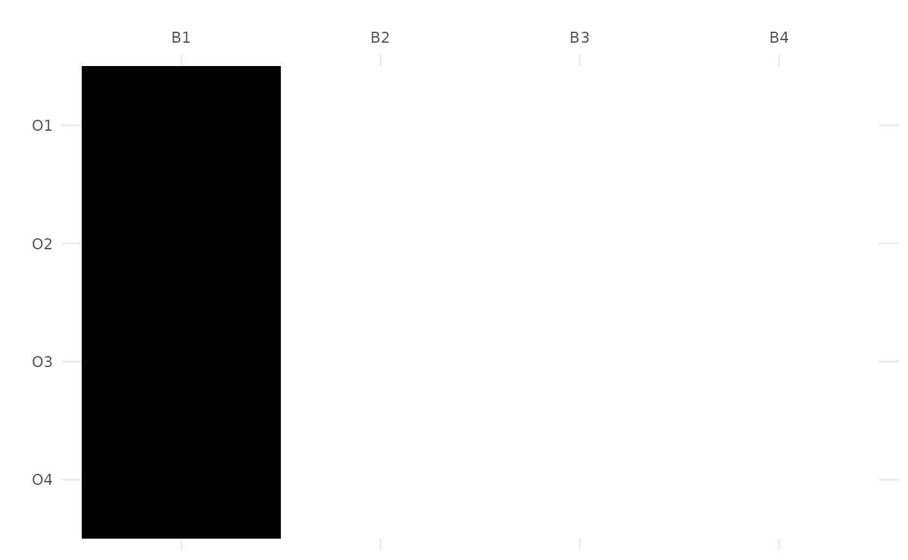

# Working with Bonds

``` r
knitr::opts_chunk$set(
  collapse = TRUE,
  comment = "#>",
  warning = FALSE,
  message = FALSE
)
```

## Introduction

In Formal Concept Analysis (FCA), a **bond** between two formal contexts
$K_{1} = \left( G_{1},M_{1},I_{1} \right)$ and
$K_{2} = \left( G_{2},M_{2},I_{2} \right)$ is a relation
$R \subseteq G_{1} \times M_{2}$ such that:

- For every object $g \in G_{1}$, the set of attributes
  $\{ m \in M_{2} \mid (g,m) \in R\}$ is an intent of $K_{2}$.
- For every attribute $m \in M_{2}$, the set of objects
  $\{ g \in G_{1} \mid (g,m) \in R\}$ is an extent of $K_{1}$.

Bonds represent “compatible” relations between the objects of one
context and the attributes of another. Mathematically, the set of all
bonds between two contexts, ordered by inclusion, forms a complete
lattice called the **Bond Lattice**.

In `fcaR`, bonds are treated as first-class citizens with a dedicated
`BondLattice` class that extends the standard `ConceptLattice`.

``` r
library(fcaR)
```

## Computing Bonds

The main function to compute bonds is
[`bonds()`](https://neuroimaginador.github.io/fcaR/reference/bonds.md).
It takes two `FormalContext` objects as input.

To keep this example fast, we will generate two small random formal
contexts ($4 \times 4$).

``` r
set.seed(42)
# Context 1
mat1 <- matrix(sample(0:1, 16, replace = TRUE), nrow = 4, ncol = 4)
rownames(mat1) <- paste0("O", 1:4)
colnames(mat1) <- paste0("A", 1:4)
fc1 <- FormalContext$new(mat1)
print(fc1)
#> FormalContext with 4 objects and 4 attributes.
#>     A1  A2  A3  A4  
#>  O1      X          
#>  O2      X   X   X  
#>  O3      X          
#>  O4      X   X

# Context 2
mat2 <- matrix(sample(0:1, 16, replace = TRUE), nrow = 4, ncol = 4)
rownames(mat2) <- paste0("P", 1:4)
colnames(mat2) <- paste0("B", 1:4)
fc2 <- FormalContext$new(mat2)
print(fc2)
#> FormalContext with 4 objects and 4 attributes.
#>     B1  B2  B3  B4  
#>  P1  X              
#>  P2  X       X      
#>  P3  X           X  
#>  P4  X           X
```

To compute the bond lattice:

``` r
bl <- bonds(fc1, fc2, method = "conexp")
bl
#> Bond Lattice between two formal contexts:
#> - Context 1 (G1): 4 objects (O1, O2...)
#> - Context 2 (M2): 4 attributes (B1, B2...)
#> - Total Bonds: 16
```

### Computation Methods

The
[`bonds()`](https://neuroimaginador.github.io/fcaR/reference/bonds.md)
function provides two optimized C++ methods:

1.  `"conexp"` (Default): Uses an implication-based approach on a tensor
    product of the contexts. It is generally the fastest for dense or
    moderately sized contexts.
2.  `"mcis"`: A backtracking algorithm that operates directly on the
    pre-computed concept sets of both contexts. It can be more efficient
    in specific structural configurations.

``` r
# Using the backtracking method
bl_mcis <- bonds(fc1, fc2, method = "mcis")
bl_mcis$size()
#> [1] 16
```

## The BondLattice Object

The result of
[`bonds()`](https://neuroimaginador.github.io/fcaR/reference/bonds.md)
is an object of class `BondLattice`. Since this class inherits from
`ConceptLattice`, you can use all standard lattice operations.

### Visualization

You can plot the Hasse diagram of the bond lattice:

`{r bl$plot()`

### Extracting Bonds

Each node in the bond lattice represents a specific bond (a relation).
You can extract these relations as individual `FormalContext` objects:

``` r
# Get all bonds as a list of FormalContexts
all_bonds <- bl$get_bonds()
length(all_bonds)
#> [1] 16

# Inspect the first non-trivial bond
# (Note: Bond 1 is usually the "Core" or minimal bond)
all_bonds[[1]]
#> FormalContext with 4 objects and 4 attributes.
#>     B1  B2  B3  B4  
#>  O1  X              
#>  O2  X              
#>  O3  X              
#>  O4  X
```

### The Core Bond

The “Core” bond is the intersection of all bonds (the infimum of the
lattice). It represents the most fundamental consensus between the two
contexts.

``` r
core <- bl$get_core()
core$plot()
```



## Verifying Bonds

If you have a relation (as a matrix or a `FormalContext`) and want to
check if it satisfies the mathematical definition of a bond between two
contexts:

``` r
# Take an existing bond and check it
mat_bond <- methods::as(all_bonds[[1]]$incidence(), "matrix")
is_bond(fc1, fc2, mat_bond)
#> [1] TRUE

# Check an arbitrary (likely invalid) relation
random_rel <- matrix(0, nrow = nrow(mat_bond), ncol = ncol(mat_bond))
is_bond(fc1, fc2, random_rel)
#> [1] FALSE
```

## Similarity and Complexity Metrics

The `BondLattice` class provides a `similarity()` method to compute
various metrics that describe the relationship between the two formal
contexts.

The following metrics are available. Let $L_{12}$ be the bond lattice
between $K_{1}$ and $K_{2}$, and $L_{11}$ and $L_{22}$ be the bond
lattices of $K_{1}$ and $K_{2}$ with themselves, respectively. We denote
the size (number of concepts) of a lattice $L$ as $|L|$.

- `log-bond`: Measures how much the two contexts share a common logical
  structure. It is calculated as the normalized log-ratio of bonds:
  $$\text{Log-Bond} = \frac{\log\left( \left| L_{12} \right| \right)}{\sqrt{\log\left( \left| L_{11} \right| \right) \cdot \log\left( \left| L_{22} \right| \right)}}$$
- `complexity`: Ratio of irreducible bonds to total bonds. Lower values
  indicate more emergent structural properties. Let
  $JI\left( L_{12} \right)$ be the set of join-irreducible elements of
  the bond lattice:
  $$\text{Complexity} = \frac{\left| JI\left( L_{12} \right) \right|}{\left| L_{12} \right|}$$
- `core-agreement`: Ratio of filled cells in the Core bond versus the
  Top (largest) bond. If $B_{core}$ is the Core bond and $B_{top}$ is
  the Top bond, and $|B|$ represents the number of elements in the
  relation (filled cells):
  $$\text{Core-Agreement} = \frac{\left| B_{core} \right|}{\left| B_{top} \right|}$$
- `entropy`: Based on the log-size of the lattices. It measures
  interaction entropy as:
  $$\text{Entropy} = \frac{\log\left( \left| L_{12} \right| \right)}{\log\left( \left| L_{11} \right| \right) + \log\left( \left| L_{22} \right| \right)}$$

The `similarity()` method returns a named vector of these metrics.

``` r
# 1. Logical Affinity (Log-Bond)
# Measures how much the two contexts share a common logical structure.
# 1.0 means perfect affinity.
bl$similarity("log-bond")
#> [1] 0.9620358

# 2. Structural Complexity
# Ratio of irreducible bonds to total bonds.
# Lower values indicate more emergent structural properties.
bl$similarity("complexity")
#> [1] 0.375

# 3. Core Agreement
# Ratio of filled cells in the Core bond versus the Top (largest) bond.
bl$similarity("core-agreement")
#> [1] 0.25

# 4. Interaction Entropy
# Based on the log-size of the lattices.
bl$similarity("entropy")
#> [1] 0.4806578
```

## Order-Theoretic Properties

Bonds also allow exploring deep structural properties of the interaction
between contexts using measures like **Width** and **Dimension**.

- **Dilworth’s Width**: The size of the largest antichain in the bond
  lattice.
- **Order Dimension**: The minimum number of linear orders whose
  intersection is the bond lattice.

``` r
# Dilworth's Width
bl$similarity("width")
#> [1] 4

# Order Dimension (estimated via heuristic)
bl$similarity("dimension")
#> [1] 2
```

These measures can also be expressed as indices normalized by the
lattice size:

- **Width Index**:
  $$\text{Width-Index} = \frac{\text{Width}\left( L_{12} \right)}{\left| L_{12} \right|}$$
- **Dimension Index**:
  $$\text{Dimension-Index} = \frac{\text{Dimension}\left( L_{12} \right)}{\log_{2}\left( \left| L_{12} \right| \right)}$$

``` r
bl$similarity("width-index")
#> [1] 0.25
bl$similarity("dimension-index")
#> [1] 0.5
```

## Summary

Bonds provide a powerful mathematical framework to analyze the alignment
or interaction between different perspectives (contexts) on the same
objects or attributes. With `fcaR`, you can efficiently calculate large
bond lattices, visualize them, and extract meaningful metrics to
quantify context similarity and structural emergence.
