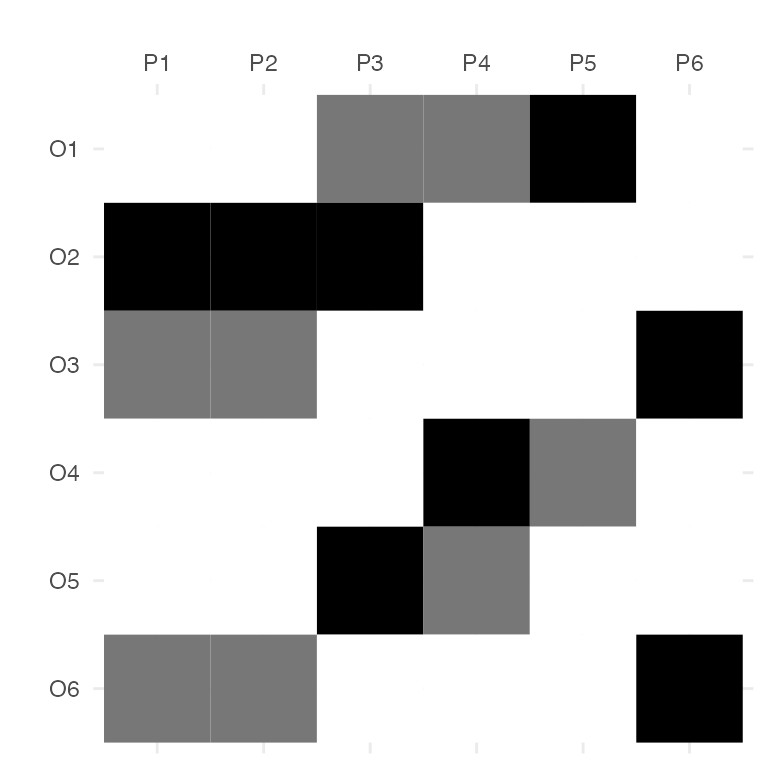

# Using FormalContexts and ConceptLattices

## Introduction

In this vignette, we present the main functionalities and data
structures of the `fcaR` package when working with formal contexts and
concepts, in FCA.

We load the `fcaR` package by:

``` r
library(fcaR)
```

## Datasets

We are going to work with two datasets, a crisp one and a fuzzy one.

The classical (binary) dataset is the well-known `planets` formal
context, presented in

> Wille R (1982). “Restructuring Lattice Theory: An Approach Based on
> Hierarchies of Concepts.” In Ordered Sets, pp. 445–470. Springer.

``` r
knitr::kable(planets, format = "html", booktabs = TRUE)
```

|         | small | medium | large | near | far | moon | no_moon |
|:--------|------:|-------:|------:|-----:|----:|-----:|--------:|
| Mercury |     1 |      0 |     0 |    1 |   0 |    0 |       1 |
| Venus   |     1 |      0 |     0 |    1 |   0 |    0 |       1 |
| Earth   |     1 |      0 |     0 |    1 |   0 |    1 |       0 |
| Mars    |     1 |      0 |     0 |    1 |   0 |    1 |       0 |
| Jupiter |     0 |      0 |     1 |    0 |   1 |    1 |       0 |
| Saturn  |     0 |      0 |     1 |    0 |   1 |    1 |       0 |
| Uranus  |     0 |      1 |     0 |    0 |   1 |    1 |       0 |
| Neptune |     0 |      1 |     0 |    0 |   1 |    1 |       0 |
| Pluto   |     1 |      0 |     0 |    0 |   1 |    1 |       0 |

The other formal context is fuzzy and is defined by the following matrix
I:

``` r
knitr::kable(I, format = "html", booktabs = TRUE)
```

|     |  P1 |  P2 |  P3 |  P4 |  P5 |  P6 |
|:----|----:|----:|----:|----:|----:|----:|
| O1  | 0.0 | 0.0 | 0.5 | 0.5 | 1.0 |   0 |
| O2  | 1.0 | 1.0 | 1.0 | 0.0 | 0.0 |   0 |
| O3  | 0.5 | 0.5 | 0.0 | 0.0 | 0.0 |   1 |
| O4  | 0.0 | 0.0 | 0.0 | 1.0 | 0.5 |   0 |
| O5  | 0.0 | 0.0 | 1.0 | 0.5 | 0.0 |   0 |
| O6  | 0.5 | 0.5 | 0.0 | 0.0 | 0.0 |   1 |

## Working with Formal Contexts

The first step when using the `fcaR` package to analyze a formal context
is to create an object of class `FormalContext` which will store all the
information related to the context.

In our examples, we create two objects:

``` r
fc_planets <- FormalContext$new(planets)
fc_I <- FormalContext$new(I)
```

Internally, the object stores information about whether the context is
binary or the names of objects and attributes, which are taken from the
rownames and colnames of the provided matrix.

### Plotting, printing and latex-ing the FormalContext

Once created the `FormalContext` objects, we can print them or plot them
as heatmaps (with functions
[`print()`](https://rdrr.io/r/base/print.html) and
[`plot()`](https://rdrr.io/r/graphics/plot.default.html)):

``` r
print(fc_planets)
#> FormalContext with 9 objects and 7 attributes.
#>          small  medium  large  near  far  moon  no_moon  
#>  Mercury   X                     X                 X     
#>    Venus   X                     X                 X     
#>    Earth   X                     X          X            
#>     Mars   X                     X          X            
#>  Jupiter                  X           X     X            
#>   Saturn                  X           X     X            
#>   Uranus           X                  X     X            
#>  Neptune           X                  X     X            
#>    Pluto   X                          X     X
print(fc_I)
#> FormalContext with 6 objects and 6 attributes.
#>      P1   P2   P3   P4   P5  P6  
#>  O1  0    0   0.5  0.5   1    0  
#>  O2  1    1    1    0    0    0  
#>  O3 0.5  0.5   0    0    0    1  
#>  O4  0    0    0    1   0.5   0  
#>  O5  0    0    1   0.5   0    0  
#>  O6 0.5  0.5   0    0    0    1
```

``` r
fc_planets$plot()
```


``` r
fc_I$plot()
```



Also, we can export the formal context as a LaTeX table:

``` r
fc_planets$to_latex()
#> \begin{table} \caption{}\label{} \centering \begin{tabular}{r|ccccccc}
#>   & $\mathrm{small}$ & $\mathrm{medium}$ & $\mathrm{large}$ & $\mathrm{near}$ & $\mathrm{far}$ & $\mathrm{moon}$ & $\mathrm{no\_moon}$\\ 
#>  \hline 
#>  $\mathrm{Mercury}$ & $\times$ &  &  & $\times$ &  &  & $\times$ \\
#> $\mathrm{Venus}$ & $\times$ &  &  & $\times$ &  &  & $\times$ \\
#> $\mathrm{Earth}$ & $\times$ &  &  & $\times$ &  & $\times$ &  \\
#> $\mathrm{Mars}$ & $\times$ &  &  & $\times$ &  & $\times$ &  \\
#> $\mathrm{Jupiter}$ &  &  & $\times$ &  & $\times$ & $\times$ &  \\
#> $\mathrm{Saturn}$ &  &  & $\times$ &  & $\times$ & $\times$ &  \\
#> $\mathrm{Uranus}$ &  & $\times$ &  &  & $\times$ & $\times$ &  \\
#> $\mathrm{Neptune}$ &  & $\times$ &  &  & $\times$ & $\times$ &  \\
#> $\mathrm{Pluto}$ & $\times$ &  &  &  & $\times$ & $\times$ &  
#>  \end{tabular}
#>  \end{table}
```

### Importing a Formal Context from File

One can also create `FormalContext`s by importing RDS, CSV or CXT files
directly:

``` r
# Read CSV
filename <- system.file("contexts", "airlines.csv",
  package = "fcaR"
)

fc1 <- FormalContext$new(filename)
fc1
#> FormalContext with 5 objects and 9 attributes.
#>                    Latin.America  Europe  Canada  Asia.Pacific  Middle.east  Africa  
#>         Air Canada       X           X       X          X            X               
#>    Air New Zealand                   X                  X                            
#>     Nippon Airways                   X                  X                            
#>   Ansett Australia                                      X                            
#>  Austrian Airlines                   X       X          X            X          X    
#> Other attributes are: Mexico, Caribbean, USA

# Read CXT
filename <- system.file("contexts", "lives_in_water.cxt",
  package = "fcaR"
)

fc2 <- FormalContext$new(filename)
fc2
#> FormalContext with 8 objects and 9 attributes.
#>              needs water to live  lives in water  lives on land  needs chlorophyll  
#>   fish leech          X                  X                                          
#>        bream          X                  X                                          
#>         frog          X                  X              X                           
#>          dog          X                                 X                           
#>  water weeds          X                  X                               X          
#>         reed          X                  X              X                X          
#>         bean          X                                 X                X          
#>         corn          X                                 X                X          
#> Other attributes are: dicotyledon, monocotyledon, can move, has limbs, breast
#> feeds
```

### Dual Formal Context

We can compute the dual formal context of a given one by using the
`dual()` method:

``` r
fc_dual <- fc_planets$dual()
fc_dual
#> FormalContext with 7 objects and 9 attributes.
#>          Mercury  Venus  Earth  Mars  Jupiter  Saturn  Uranus  Neptune  Pluto  
#>    small    X       X      X      X                                       X    
#>   medium                                                  X       X            
#>    large                                 X        X                            
#>     near    X       X      X      X                                            
#>      far                                 X        X       X       X       X    
#>     moon                   X      X      X        X       X       X       X    
#>  no_moon    X       X
```

The result is a `FormalContext` where attributes are now the objects of
the previous formal context and viceversa.

### Closures

The basic operation in FCA is the computation of closures given an
attribute set, by using the two derivation operators, extent and intent.

The intent of a (probably fuzzy) set of objects is the set of their
common attributes:

``` r
# Define a set of objects
S <- Set$new(attributes = fc_planets$objects)
S$assign(Earth = 1, Mars = 1)
S
#> {Earth, Mars}

# Compute the intent of S
fc_planets$intent(S)
#> {small, near, moon}
```

Analogously, the extent of a set of attributes is the set of objects
which possess all the attributes in the given set:

``` r
# Define a set of objects
S <- Set$new(attributes = fc_planets$attributes)
S$assign(moon = 1, large = 1)
S
#> {large, moon}

# Compute the extent of S
fc_planets$extent(S)
#> {Jupiter, Saturn}
```

The composition of intent and extent is the closure of a set of
attributes:

``` r
# Compute the closure of S
Sc <- fc_planets$closure(S)
Sc
#> {large, far, moon}
```

This means that all planets which have the attributes `moon` and `large`
also have `far` in common.

We can check whether a set is closed (that is, it is equal to its
closure), using `is_closed()`:

``` r
fc_planets$is_closed(S)
#> [1] FALSE
fc_planets$is_closed(Sc)
#> [1] TRUE
```

### Clarification and Reduction

An interesting point when managing formal contexts is the ability to
reduce the context, removing redundancies, while retaining all the
knowledge. This is accomplished by two functions: `clarify()`, which
removes duplicated attributes and objects (columns and rows in the
original matrix); and `reduce()`, which uses closures to remove
dependent attributes, but only on binary formal contexts. The resulting
`FormalContext` is equivalent to the original one in both cases.

``` r
fc_planets$reduce(TRUE)
#> FormalContext with 5 objects and 7 attributes.
#>                    small  medium  large  near  far  moon  no_moon  
#>              Pluto   X                          X     X            
#>   [Mercury, Venus]   X                     X                 X     
#>      [Earth, Mars]   X                     X          X            
#>  [Jupiter, Saturn]                  X           X     X            
#>  [Uranus, Neptune]           X                  X     X

fc_I$clarify(TRUE)
#> FormalContext with 5 objects and 5 attributes.
#>            P3   P4   P5  P6  [P1, P2]  
#>        O1 0.5  0.5   1    0      0     
#>        O2  1    0    0    0      1     
#>        O4  0    1   0.5   0      0     
#>        O5  1   0.5   0    0      0     
#>  [O3, O6]  0    0    0    1     0.5
```

Note that merged attributes or objects are stored in the new formal
context by using squared brackets to unify them,
e.g. `[Mercury, Venus]`.

### Extracting Implications and Concepts

The function to extract the canonical basis of implications and the
concept lattice is `find_implications()`. Its use is to store a
`ConceptLattice` and an `ImplicationSet` objects internally in the
`FormalContext` object after running the NextClosure algorithm.

It can be used both for binary and fuzzy formal contexts, resulting in
binary or fuzzy concepts and implications:

``` r
fc_planets$find_implications()

fc_I$find_implications()
```

We can inspect the results as:

``` r
# Concepts
fc_planets$concepts
#> A set of 12 concepts:
#> 1: ({Mercury, Venus, Earth, Mars, Jupiter, Saturn, Uranus, Neptune, Pluto}, {})
#> 2: ({Earth, Mars, Jupiter, Saturn, Uranus, Neptune, Pluto}, {moon})
#> 3: ({Jupiter, Saturn, Uranus, Neptune, Pluto}, {far, moon})
#> 4: ({Jupiter, Saturn}, {large, far, moon})
#> 5: ({Uranus, Neptune}, {medium, far, moon})
#> 6: ({Mercury, Venus, Earth, Mars, Pluto}, {small})
#> 7: ({Earth, Mars, Pluto}, {small, moon})
#> 8: ({Pluto}, {small, far, moon})
#> 9: ({Mercury, Venus, Earth, Mars}, {small, near})
#> 10: ({Mercury, Venus}, {small, near, no_moon})
#> 11: ({Earth, Mars}, {small, near, moon})
#> 12: ({}, {small, medium, large, near, far, moon, no_moon})

# Implications
fc_planets$implications
#> Implication set with 10 implications.
#> Rule 1: {no_moon} -> {small, near}
#> Rule 2: {far} -> {moon}
#> Rule 3: {near} -> {small}
#> Rule 4: {large} -> {far, moon}
#> Rule 5: {medium} -> {far, moon}
#> Rule 6: {medium, large, far, moon} -> {small, near, no_moon}
#> Rule 7: {small, near, moon, no_moon} -> {medium, large, far}
#> Rule 8: {small, near, far, moon} -> {medium, large, no_moon}
#> Rule 9: {small, large, far, moon} -> {medium, near, no_moon}
#> Rule 10: {small, medium, far, moon} -> {large, near, no_moon}
```

### Standard Context

Once we have computed the concepts, we can build the *standard context*
(J, M, $\leq$), where J is the set of join-irreducible concepts and M
are the meet-irreducible ones. Join and meet are another name for
supremum and infimum operations in the concept lattice.

The function `standardize()` works for all FormalContext where the
concept lattice has been found, and it produces a new `FormalContext`
object:

``` r
fc_planets$standardize()
#> FormalContext with 5 objects and 7 attributes.
#>     M1  M2  M3  M4  M5  M6  M7  
#>  J1  X   X   X                  
#>  J2  X   X       X              
#>  J3  X   X           X          
#>  J4                  X   X   X  
#>  J5  X               X   X
fc_I$standardize()
#> FormalContext with 9 objects and 9 attributes.
#>     M1  M2  M3  M4  M5  M6  M7  M8  M9  
#>  J1  X   X       X                      
#>  J2  X   X   X   X                      
#>  J3  X   X   X       X                  
#>  J4  X               X   X              
#>  J5  X           X   X   X              
#>  J6  X   X   X   X   X   X              
#>  J7                          X   X      
#>  J8                          X   X   X  
#>  J9                  X   X   X       X
```

Note that now objects are named J1, J2… and attributes are M1, M2…, from
join and meet.

### Saving and loading

A `FormalContext` is saved in RDS format using its own
[`save()`](https://rdrr.io/r/base/save.html) method, which is more
efficient than the base
[`saveRDS()`](https://rdrr.io/r/base/readRDS.html) and
[`readRDS()`](https://rdrr.io/r/base/readRDS.html).

``` r
fc$save(filename = "./fc.rds")
```

In order to load a previously saved `FormalContext`, it suffices to do:

``` r
fc2 <- FormalContext$new("./fc.rds")
```

In this case, `fc` and `fc2` contain the same information.

## Concept Lattice

We are going to use the previously computed concept lattices for the two
`FormalContext` objects.

### Plot, print and LaTeX

The concept lattice can be plotted using a Hasse diagram and the
function [`plot()`](https://rdrr.io/r/graphics/plot.default.html) inside
the `ConceptLattice` component:

``` r
fc_planets$concepts$plot()
```


``` r
fc_I$concepts$plot()
```


If one desires to get the list of concepts printed, or in LaTeX format,
just:

``` r
# Printing
fc_planets$concepts
#> A set of 12 concepts:
#> 1: ({Mercury, Venus, Earth, Mars, Jupiter, Saturn, Uranus, Neptune, Pluto}, {})
#> 2: ({Earth, Mars, Jupiter, Saturn, Uranus, Neptune, Pluto}, {moon})
#> 3: ({Jupiter, Saturn, Uranus, Neptune, Pluto}, {far, moon})
#> 4: ({Jupiter, Saturn}, {large, far, moon})
#> 5: ({Uranus, Neptune}, {medium, far, moon})
#> 6: ({Mercury, Venus, Earth, Mars, Pluto}, {small})
#> 7: ({Earth, Mars, Pluto}, {small, moon})
#> 8: ({Pluto}, {small, far, moon})
#> 9: ({Mercury, Venus, Earth, Mars}, {small, near})
#> 10: ({Mercury, Venus}, {small, near, no_moon})
#> 11: ({Earth, Mars}, {small, near, moon})
#> 12: ({}, {small, medium, large, near, far, moon, no_moon})

# LaTeX
fc_planets$concepts$to_latex()
#> Note: You must include the following commands in you LaTeX document:
#> \usepackage{amsmath}\newcommand{\el}[2]{\ensuremath{^{#2\!\!}/{#1}}}
#> \begin{longtable*}{lll}
#> 1: &$\left(\,\left\{\mathrm{Mercury}, \mathrm{Venus}, \mathrm{Earth}, \mathrm{Mars}, \mathrm{Jupiter}, \mathrm{Saturn}, \mathrm{Uranus}, \mathrm{Neptune}, \mathrm{Pluto}\right\},\right.$&$\left.\ensuremath{\varnothing}\,\right)$\\
#> 2: &$\left(\,\left\{\mathrm{Earth}, \mathrm{Mars}, \mathrm{Jupiter}, \mathrm{Saturn}, \mathrm{Uranus}, \mathrm{Neptune}, \mathrm{Pluto}\right\},\right.$&$\left.\left\{\mathrm{moon}\right\}\,\right)$\\
#> 3: &$\left(\,\left\{\mathrm{Jupiter}, \mathrm{Saturn}, \mathrm{Uranus}, \mathrm{Neptune}, \mathrm{Pluto}\right\},\right.$&$\left.\left\{\mathrm{far}, \mathrm{moon}\right\}\,\right)$\\
#> 4: &$\left(\,\left\{\mathrm{Jupiter}, \mathrm{Saturn}\right\},\right.$&$\left.\left\{\mathrm{large}, \mathrm{far}, \mathrm{moon}\right\}\,\right)$\\
#> 5: &$\left(\,\left\{\mathrm{Uranus}, \mathrm{Neptune}\right\},\right.$&$\left.\left\{\mathrm{medium}, \mathrm{far}, \mathrm{moon}\right\}\,\right)$\\
#> 6: &$\left(\,\left\{\mathrm{Mercury}, \mathrm{Venus}, \mathrm{Earth}, \mathrm{Mars}, \mathrm{Pluto}\right\},\right.$&$\left.\left\{\mathrm{small}\right\}\,\right)$\\
#> 7: &$\left(\,\left\{\mathrm{Earth}, \mathrm{Mars}, \mathrm{Pluto}\right\},\right.$&$\left.\left\{\mathrm{small}, \mathrm{moon}\right\}\,\right)$\\
#> 8: &$\left(\,\left\{\mathrm{Pluto}\right\},\right.$&$\left.\left\{\mathrm{small}, \mathrm{far}, \mathrm{moon}\right\}\,\right)$\\
#> 9: &$\left(\,\left\{\mathrm{Mercury}, \mathrm{Venus}, \mathrm{Earth}, \mathrm{Mars}\right\},\right.$&$\left.\left\{\mathrm{small}, \mathrm{near}\right\}\,\right)$\\
#> 10: &$\left(\,\left\{\mathrm{Mercury}, \mathrm{Venus}\right\},\right.$&$\left.\left\{\mathrm{small}, \mathrm{near}, \mathrm{no\_moon}\right\}\,\right)$\\
#> 11: &$\left(\,\left\{\mathrm{Earth}, \mathrm{Mars}\right\},\right.$&$\left.\left\{\mathrm{small}, \mathrm{near}, \mathrm{moon}\right\}\,\right)$\\
#> 12: &$\left(\,\ensuremath{\varnothing},\right.$&$\left.\left\{\mathrm{small}, \mathrm{medium}, \mathrm{large}, \mathrm{near}, \mathrm{far}, \mathrm{moon}, \mathrm{no\_moon}\right\}\,\right)$\\
#> \end{longtable*}
```

### Getting all extents, intents and retrieving concepts

For a `ConceptLattice`, one may want to retrieve particular concepts,
using a subsetting as in `R`:

``` r
fc_planets$concepts[2:3]
#> A set of 2 concepts:
#> 1: ({Earth, Mars, Jupiter, Saturn, Uranus, Neptune, Pluto}, {moon})
#> 2: ({Jupiter, Saturn, Uranus, Neptune, Pluto}, {far, moon})
```

Or get all the extents and all the intents of all concepts, as sparse
matrices:

``` r
fc_planets$concepts$extents()
fc_planets$concepts$intents()
```

### Concept support

The support of concepts can be computed using the function
[`support()`](https://rdrr.io/pkg/arules/man/support.html):

``` r
fc_planets$concepts$support()
#>  [1] 1.0000000 0.7777778 0.5555556 0.2222222 0.2222222 0.5555556 0.3333333
#>  [8] 0.1111111 0.4444444 0.2222222 0.2222222 0.0000000
```

### Sublattices

When the concept lattice is too large, it can be useful in certain
occasions to just work with a sublattice of the complete lattice. To
this end, we use the `sublattice()` function.

For instance, to build the sublattice of those concepts with support
greater than 0.5, we can do:

``` r
# Get the index of those concepts with support
# greater than the threshold
idx <- which(fc_I$concepts$support() > 0.2)
# Build the sublattice
sublattice <- fc_I$concepts$sublattice(idx)
sublattice
#> A set of 20 concepts:
#> 1: ({O1, O2, O3, O4, O5, O6}, {})
#> 2: ({O1, O4, O5}, {P4 [0.50]})
#> 3: ({O1, O4}, {P4 [0.50], P5 [0.50]})
#> 4: ({O1, O4 [0.50]}, {P4 [0.50], P5})
#> 5: ({O1 [0.50], O4, O5 [0.50]}, {P4})
#> 6: ({O1 [0.50], O4}, {P4, P5 [0.50]})
#> 7: ({O1 [0.50], O4 [0.50]}, {P4, P5})
#> 8: ({O1, O2, O5}, {P3 [0.50]})
#> 9: ({O1, O5}, {P3 [0.50], P4 [0.50]})
#> 10: ({O1}, {P3 [0.50], P4 [0.50], P5})
#> 11: ({O1 [0.50], O2, O5}, {P3})
#> 12: ({O1 [0.50], O5}, {P3, P4 [0.50]})
#> 13: ({O1 [0.50], O5 [0.50]}, {P3, P4})
#> 14: ({O1 [0.50]}, {P3, P4, P5})
#> 15: ({O2, O3, O6}, {P1 [0.50], P2 [0.50]})
#> 16: ({O3, O6}, {P1 [0.50], P2 [0.50], P6})
#> 17: ({O2, O3 [0.50], O6 [0.50]}, {P1, P2})
#> 18: ({O3 [0.50], O6 [0.50]}, {P1, P2, P6})
#> 19: ({O2}, {P1, P2, P3})
#> 20: ({}, {P1, P2, P3, P4, P5, P6})
```

And we can plot just the sublattice:

``` r
sublattice$plot()
```


### Subconcepts, superconcepts, infimum and supremum

It may be interesting to use the notions of subconcept and superconcept.
Given a concept, we can compute all its subconcepts and all its
superconcepts:

``` r
# The fifth concept
C <- fc_planets$concepts$sub(5)
C
#> ({Uranus, Neptune}, {medium, far, moon})
# Its subconcepts:
fc_planets$concepts$subconcepts(C)
#> A set of 2 concepts:
#> 1: ({Uranus, Neptune}, {medium, far, moon})
#> 2: ({}, {small, medium, large, near, far, moon, no_moon})
# And its superconcepts:
fc_planets$concepts$superconcepts(C)
#> A set of 4 concepts:
#> 1: ({Mercury, Venus, Earth, Mars, Jupiter, Saturn, Uranus, Neptune, Pluto}, {})
#> 2: ({Earth, Mars, Jupiter, Saturn, Uranus, Neptune, Pluto}, {moon})
#> 3: ({Jupiter, Saturn, Uranus, Neptune, Pluto}, {far, moon})
#> 4: ({Uranus, Neptune}, {medium, far, moon})
```

Also, we can define infimum and supremum of a set of concepts as the
greatest common subconcept of all the given concepts, and the lowest
common superconcept of them, and can be computed by:

``` r
# A list of concepts
C <- fc_planets$concepts[5:7]
C
#> A set of 3 concepts:
#> 1: ({Uranus, Neptune}, {medium, far, moon})
#> 2: ({Mercury, Venus, Earth, Mars, Pluto}, {small})
#> 3: ({Earth, Mars, Pluto}, {small, moon})

# Supremum of the concepts in C
fc_planets$concepts$supremum(C)
#> ({Mercury, Venus, Earth, Mars, Jupiter, Saturn, Uranus, Neptune, Pluto}, {})
# Infimum of the concepts in C
fc_planets$concepts$infimum(C)
#> ({}, {small, medium, large, near, far, moon, no_moon})
```

### Join- and meet- irreducible elements

Also irreducible elements with respect to join (supremum) and meet
(infimum) can be computed for a given concept lattice:

``` r
fc_planets$concepts$join_irreducibles()
#> A set of 5 concepts:
#> 1: ({Jupiter, Saturn}, {large, far, moon})
#> 2: ({Uranus, Neptune}, {medium, far, moon})
#> 3: ({Pluto}, {small, far, moon})
#> 4: ({Mercury, Venus}, {small, near, no_moon})
#> 5: ({Earth, Mars}, {small, near, moon})
fc_planets$concepts$meet_irreducibles()
#> A set of 7 concepts:
#> 1: ({Earth, Mars, Jupiter, Saturn, Uranus, Neptune, Pluto}, {moon})
#> 2: ({Jupiter, Saturn, Uranus, Neptune, Pluto}, {far, moon})
#> 3: ({Jupiter, Saturn}, {large, far, moon})
#> 4: ({Uranus, Neptune}, {medium, far, moon})
#> 5: ({Mercury, Venus, Earth, Mars, Pluto}, {small})
#> 6: ({Mercury, Venus, Earth, Mars}, {small, near})
#> 7: ({Mercury, Venus}, {small, near, no_moon})
```

This are the concepts used to build the *standard context*, mentioned
above.
